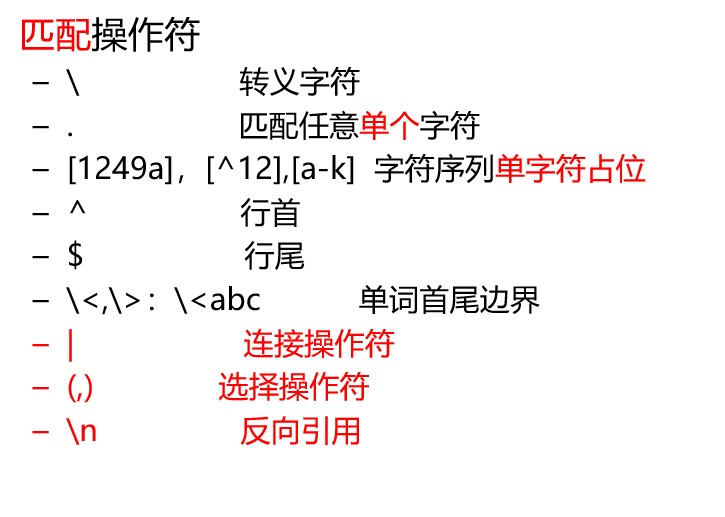
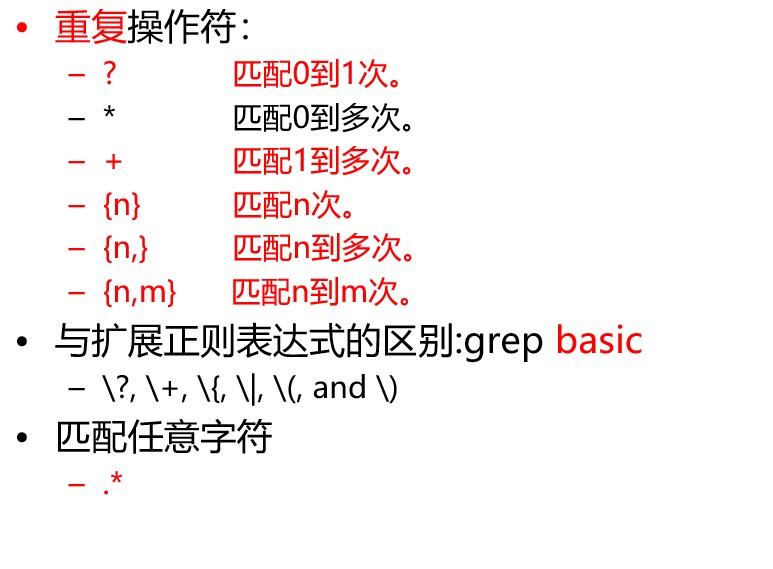

- type(类似 which)
  - type 能指定磁盘位置的命令，也就是从 PATH 中查询的命令，被称为**外部命令**,外部命令执行时都会变为一个进程
  - 外部命令都可以通过`man 命令名称`查看文档
  - 可能是可执行程序，也可能是脚本（比如 python 脚本等）
  - 如果 type 返回 shell builtin，则是内部命令。shell 内部的。比如 cd，echo
- file
- echo 返回输入变量
  > echo \$PATH
- 环境变量
  - windows 中用两个%取环境变量的值，用;分割
  - linux 中用\$取值，用:分割
  - %path% == \$PATH
- yum install man man-pages
  > man 是帮助程序 man-pages 是扩充的帮助页<br>
  > 也可以 `man ascii` `man utf-8`<br>
- man 可以查的一共是：
  - 1,用户命令(/bin,/usr/bin,/usr/local/bin)，
  - 2.系统调用，`man 2 read`
  - 3.库用户，
  - 4.特殊文件(设备文件)
  - 5.文件格式(配置文件的语法)
  - 6.游戏，杂项(Miscellaneous)
  - 7.管理命令(/sbin,/usr/sbin,/usr/local/sbin)
- 外部命令用 man，内部命令用 help(help 也是内部命令)
- whereis 定位命令位置,同时指出帮助文档位置
- which 定位命令位置
- file descriptor:文件描述符/文件句柄。linux 中数字代表进程中的某一个流，任何进程最基本的三个流：
  - 0 输入流
  - 1 正确的输出流
  - 2 错误的输出流
- 目录

  - /boot:系统启动相关文件
  - /etc:配置文件
  - /home:存放除 root 用户外的用户目录
  - /root:root 用户目录
  - /media:挂载点目录，移动设备
  - /mnt:挂载点目录，额外的临时文件系统
  - /proc:伪文件系统，内核映射文件
  - /sys:伪文件系统，跟硬件设备有关的属性映射文件
  - /tmp:临时文件，/var/tmp 也是
  - /var:可变化文件，存储数据库表数据等
  - /bin:二进制可执行文件，用户命令
  - /sbin:管理员命令
  - /lib:库文件，linux 中的 so，windows 中的 lib
  - /dev:设备文件，linux，一切皆文件
  - /opt:额外安装的可选应用程序包所放置的位置。一般情况下，我们可以把 tomcat 等都安装到这里。
  - /usr:是 Unix Software Resource 的缩写,用于存放系统应用程序，比较重要的目录/usr/local 本地系统管理员软件安装目录（安装系统级的应用）。这是最庞大的目录，要用到的应用程序和文件几乎都在这个目录。

- 磁盘信息：
  - df:显示硬盘分区。
    - linux 中没有盘符概念，只有一棵虚拟的目录树，所有分区中的目录都会放在根目录/下的某文件夹(不一定是子级)。比如/boot 目录就是一个分区。
    - 有啥问题时，先 df，看看磁盘满没
  - du -sh ./\*:统计此文件夹下每个目录大小
  - 清楚数据前一定要备份
- 文件类型：
  > 扩展名只在图形化界面上有用
  - `-`:普通文件：文本文件，excel 文件，MP4 文件等
  - `d`:文件夹
  - `c`或`b` 设备文件。
    - `c`:字符型设备：比如显示器，一个像素点需要 rgb 三原色的数据，三个字节。比如键盘，组合键
    - `b`:字节型设备：比如硬盘
  - `l`:快捷方式
  - `p`:pipe,管道
  - `s`:socket
- `命令的七步扩展`，有兴趣查查
- hash:存储执行过的命令，提高下一次命令查找速度
  - hash -r 清除
- 文件系统命令：

  - df
  - du
  - ls
    - ls -lha
    - ls -i 显示文件所在磁盘的索引
  - cd
    - cd ~
    - cd ~普通用户用户名（只有 root 用户用到）
    - cd
    - cd path
    - cd -
  - pwd
  - mkdir
    - mkdir -p parent，有需要的话创建父级目录
    - mkdir ./abc/{x,y,z}dir 水平创建，./abc/xdir,./abc/ydir,./abc/zdir
  - rm
    > 千万别 rm -fr / <br>
    > 能 mv 移动 别删
    - rm -f file
    - rm -r folder
  - mv 移动或重命名
  - cp
    - cp -r 递归拷贝
  - ln
    - ln 硬链接　会指向硬盘同一位置。类型：`-`
    - ln -s 　软链接，只是指向一个目录。就是 windows 上的快捷方式　类型：`l`
  - stat:元数据，相当于 window 的文件属性
    - Change 描述元数据发生变化的时间，比如权限
    - Modify 文件内容修改时间
    - Access 访问时间
    - IO Block 一次 io 读写多少
    - Inode 磁盘位置索引
  - touch
    - 更新指定已有文件元数据的三个时间
    - 创建新文件

- cat
- more
- less
- head 显示最前面的内容，-4 表示显示四行
- tail 显示最后面的内容，-4 表示显示四行
  > head -4 file | tail -1 显示第四行
- 管道：

  - cat file | more 可以分屏显示内容
  - echo "/" | ls -l **不会显示根目录文件夹**
    > 每个程序都有输入流，但不一定会用到。比如 ls，只会判定传入的参数，而并没有读取输入流
  - echo "/" | xargs ls -l 可以显示根目录文件夹
    - 管道前命令是 echo
    - 管道后命令是 xargs
    - "/"通过管道，流入 xargs 命令中
    - xargs 后接的第一个参数会被识别为命令，剩下的参数识别为命令的选项参数，再将输入流中的信息作为命令的参数，再把命令执行

- ppt 中，红色的为扩展正则表达式，黑色的为基本正则表达式
  >  > 

* grep 匹配输出

  - `-v` 反显
  - `-e` 使用扩展正则表达式
  - **grep和vim 中默认()为字符，如果要分组就要使用`\(word\)`**※
  - **python 中()默认为分组，通过\进行转义为字符**
  - 另外括号嵌套是，比如(())，数左括号，左边第一个是第一组，第二个是第二组
  - 正则表达式单词边界匹配(grep 独有,python 中为\b)：
    - `\<abc` 以 abc 开头的单词
    - `def\>` 以 def 结尾的单词
    - `\<word\>` word 单词。注意，这样查到的`$word` `word.`也是符合的

* cut：切割行。比如查看数据库表数据时

  - f:选择显示的列
  - s:不显示没有分隔符的行
  - d:自定义分隔符
  - 例：
    - `cut -d' ' -f1 file` 以空格为分隔符切割后显示第一列
    - `cut -d' ' -f1,3 file` 以空格为分隔符切割后显示第一和三列
    - `cut -d' ' -f1-3 file` 以空格为分隔符切割后显示第一列到第三列

* sort:排序文件的行后输出。字典序或数值序

  - n:按数值排序。默认字典序。（从第一个字符进行排序）
  - 自定义排序方式:
    > sort -t' ' -k2 以空格为分隔符，通过第二列字典序进行排序
    - t:自定义分隔符
    - k:选择排序列
  - r:倒序
  - u:合并相同行
  - f:忽略大小写

* wc:统计。linw，word，bytes

  - l:只统计行数
  - 通常统计后面会有文件名，通过 cat file | wc -l 可以统计行数而不带文件名
  - 其他统计用 man 查一下吧

* sed :行编辑器
  > 类似 vi 的末行模式,只会显示修改后的内容，要加 i 选项才能保存到文件中
  - 选项
    - sed [options] `AddressCommand` file
    - n 静默模式，处理而不打印出
    - i 直接修改一个文件，直接作用到文件
    - `-e script -e script` 可以执行多个脚本，一个-e 后一个脚本
    - f /path/to/sed_script 读取文件中的命令
    - r 使用扩展正则表达式
  - Command:
    - d 删除符合条件的行；
    - p:显示符合条件的行；
    - a\string:在指定的行后面追加新行，内容为 string
    - \n:可以用于换行
    - i\string:在指定的行前面添加新行，内容为 string
    - r FILE:将指定的文件的内容添加至符合条件的行处
    - w FILE:将地址指定的范围内的行另存至指定的文件中；
    - s/pattern/string/修饰符：查找并替换，默认只替换每行中第一次被模式匹配到的字符串
      - g:行内全局替换
      - i:忽略字符大小写
      - s///: s###, s@@@
      - \Q),\1,\2
  - Address
    - 可以没有
    - 给定范围
    - 查找有指定内容的行/str/
  - 演示：
    - `sed "1a\hello world" test.txt` 在第一行后追加新行，内容为 hello world
    - `sed "/hello/d" test.txt` 删除有 hello 的行
    - `sed -n "/[0-9]/p" test.txt` 显示包含数字的行 可以由 `grep "[0-9] test.txt"代替`
    - `sed "s/3333/11111/g"` 替换

- awk
  - 说明:
    - awk是一个强大的文本分析工具。
    - 相对于grep的查找，sed的编辑，awk在其对数据分析并生成报告时， 显得尤为强大。
    - 简单来说awk就是把文件逐行的读入，空格，制表符）为默认分隔符 将每行切片，切开的部分再进行各种分析处理。 
    - 可以用来代替cut，sort，sed
  - 使用：
    - awk -F '{pattern + action}' {filenames}
      > **必须是单引号**
    - 支持自定义分隔符
    - 支持正则表达式匹配
    - 支持自定义变量，数组  a[1]  a[tom]  map(key)
    - 支持内置变量
      - NF                 浏览记录的域的个数
      - NR                 已读的记录数(行数)
      - ARGC               命令行参数个数
      - ARGV               命令行参数排列
      - ENVIRON            支持队列中系统环境变量的使用
      - FILENAME           awk浏览的文件名
      - FNR                浏览文件的记录数
      - FS                 设置输入域分隔符，等价于命令行 -F选项
      - OFS                输出域分隔符
      - ORS                输出记录分隔符
      - RS                 控制记录分隔符
    - 支持函数
      - print、split、substr、sub、gsub
    - 支持流程控制语句，类C语言
      - if、while、do/while、for、break、continue
  - 示例：
    - `awk -F':' '{print $1}' passwd ` 打印以冒号分割得到的第一列  。相当于 `cut -d':' -f1 passwd`
    - `awk -F':' 'BEGIN{print "name\shell"}  {print $1 "\t" $7}  END{print "end"}' passwd ` 打印表头，分割后的1，7行，最后结束提示
      - BEGIN{}是在处理前调用
      - 匿名函数是每行的操作
      - END{}是处理完后调用
    - `awk '/word/ {print $0}'` 打印包含word的行
    - `awk '/word/ {print $0} {print $0}'` 打印包含word的行后，再全打印一遍
    - `awk -F':' '{print NR"\t"NF"\t"$0}'`打印每行行号，列数，完成内容，为一个表格
    - 计算合计工资
      ```
      统计报表：合计每人1月工资，0：manager，1：worker
      Tom	 0   2012-12-11      car     3000
      John	 1   2013-01-13      bike    1000
      vivi	 1   2013-01-18      car     2800
      Tom	 0   2013-01-20      car     2500
      John	 1   2013-01-28      bike    3500

      结果比如: tom worker 2500

      ```


- 计算机开机-->计算机内核进内存-->加载根目录分区进内存-->引导sbin目录下init程序作为第一个进程-->该进程读取/etc/inittab  中的开机设置
  > 小知识
  - 3 是命令行模式，
  - 5是图形界面模式，
  - 0是直接关机无法开机，
  - 6是立刻重启死循环，
  - 1是单用户模式（物理服务器身边，重启时可以设置，不需要密码登录，修改密码时用）
  - 不过linux中图形界面并没有在内核代码中，需要安装后台程序

- /etc/passwd文件
  - root:x:0:0:root:/root:/bin/bash
  - 冒号分隔符
  - 一行是一个用户的信息
  - 用户名:x:用户id号:组id号:用户描述信息:用户家目录:用户以交互模式登录时的shell外壳程序
    > 原本加密后的密码是保存在x那里的，但因为不安全，所以移除了，x用来占位
