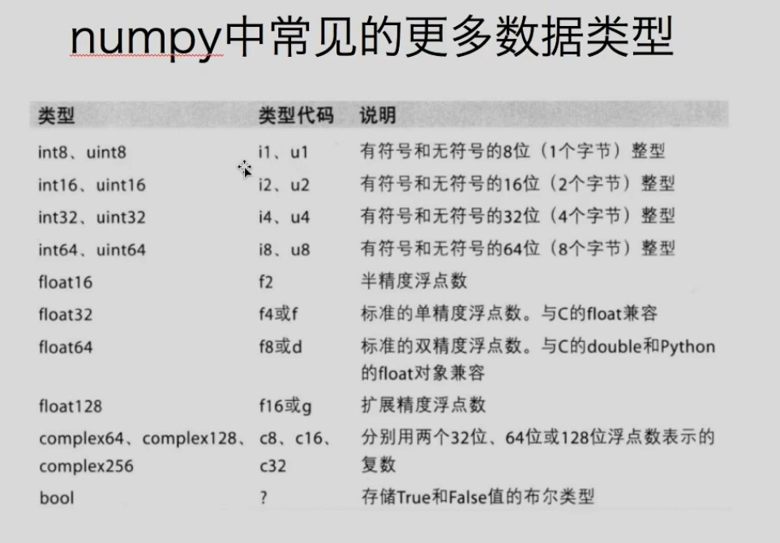

# 1. matplotlib

- matplotlib 是仿照 MATLAB 构建的数据可视化的 python 库
- 示例：

  ```python
  from matplotlib import pyplot as plt

  x = range(0,24,2)
  y = [15,12,12,12,12,12,12,12,16,11,11,11]

  plt.plot(x,y)
  plt.show()
  ```

## 1.1. 绘制折线图

- 图片调整：plt.figure(figsize=(20,8),dpi=80)
  - 图片大小：宽 20，高 8
  - dpi 表示每英寸点的个数，越高图片越清洗
- 保存图片：plt.savefig("./plt1.png")
  - 可以保存为 svg 矢量图格式，放大不会有锯齿
- 设置 x 轴刻度：plt.xticks(range(0,24))
- 设置 y 轴刻度：plt.yticks(range(0,24))
- 设置 x 轴刻度为字符串
  ```py
  # x为int列表，_x为字符串，两者长度相同，一一对应
  plt.xticks(x,_x)
  ```
- 设置中文字体
  - linux/mac 下查看支持中文的字体：`fc-list :lang=zh`
  - 修改：
    - 导入 matplotlib 后
    - py 文件中通过调用 matplotlib.rc({})可以修改(window/linux)或
      ```python
      import matplotlib
      matplotlib.rc({
        'family':'Microsoft Yahei',
        'Weight':'blod',
        'size':'large`
      })
      ```
    - py 文件中通过调用 matplotlib.font-manager(fname = "path")可以解决（window/linux/mac）
      ```py
      from matlotlib import font_manager
      my_font =font_manager.FontProperties(fname = "path .ttc")
      plt.xticks(fontproperties = my_font)
      ```
- 添加描述信息
  - 添加 x,y 轴描述信息
    ```py
    plt.xlable("时间",fontpropeties=my_font)
    plt.ylable("温度",fontpropeties=my_font)
    ```
  - 添加题目:`plt.title("题目",fontpropeties=my_font)`
- 设置网格：
  - plt.grid()
    > alpha=0.1 设置透明度
- 添加图例：
  ```py
  plt.plot(x,y1,lable="name1")
  plt.plot(x,y2,lable="name2")
  plt.legend(prop = my_font)
  # 加入prop来显示中文，其他地方都写fontproperties
  ```
- 设置线样式
  ```py
  # 查源码去！！
  plt.plot(x,y,color = "",linestyle="",linewidth="",alpha="")
  ```

## 1.2. 绘制散点图

- 示例：
  ```py
  plt.scatter(x,y)
  ```

## 1.3. 绘制条形图

```py
plt.bar(x,y)

# 设置粗细
plt.bar(x,y,width=0.3)

# 绘制横着的条形图，注意，竖着得依旧为y。第一个传给横着得轴，第二个传给竖着的轴
plt.barh(y,x)

# 设置粗细，因为横了，所以成了height
plt.barh(x,y,height=0.3)

```

## 1.4. 绘制直方图

```py
# 极差是80，组数为20，组距为4
# 如果不能整除，组距也会变成非整数
data = [random.randint(0,80) for i in range(100)]
plt.figure(figsize=(16,8))
plt.grid()
# 传入 数据，组数
plt.hist(data,20)
plt.xticks(range(80)[::2])
plt.show()
```

## 1.5. 其他画图

> 清冽推荐前俩

- Echarts
- plotly
- seaborn

# 2. numpy

> 看ppt吧

- 数据类型：

  > 
  > 位数默认和操作系统保持一致。通过 dtype 指定类型

- arr.flatten()
- 0/0 = nan
- 0/非零 = inf

- 广播原则：

  > 从后往前算起，一样的进行计算，比如(3,3,2)的三维数组(3,2)的二维数组之间可以进行计算

- 读取文件：np.loadtxt()。一般读取 csv 文件

  | 参数      | 解释                                                                |
  | :-------- | :------------------------------------------------------------------ |
  | frame     | 文件、字符串或产生器，可以是.gz 或 bz2 压缩文件                     |
  | dtype     | 数据类型，可选，CSV 的字符串以什么数据类型读入数组中，默认 np.float |
  | delimiter | 分隔字符串，默认是任何空格，改为逗号                                |
  | skiprows  | 跳过前 × 行，一般跳过第一行表头                                     |
  | usecols   | 读取指定的列，索引，元组类型                                        |
  | unpack    | 是否进行转置，默认为 false                                          |

- arr.transpose()转置
- arr.swapaxes()交换轴，效果和转置一样
- arr.astype(类型) 转换类型
- 分片：
  ```py
  # 取不到末尾
  # arr为二维数组
  arr[1:3] # 1-3行
  arr[[1,3,4]] # 1,3,4行

  arr[,] # 逗号前为行，逗号后为列
  arr[[1,2],0:3]  # 1,2行的0-3列
  arr[0:3,0:3]  # 0-3行的0-3列
  arr[[1,3],[4,5]] # 1,3行的4，5列4
  arr[::3,::2] # 步长为3取行，步长为2取列

  arr[[1,2],:] = arr[[2,1],:] # 交换行
  arr[:,[1,2]] = arr[:,[2,1]] # 交换行

  arr[arr<10] = 0 # arr>10返回一个二维boolean矩阵，然后只取true位置对应的，再进行赋值
  ```

- 三元运算符  
  ```py
  np.where(arr>10,100,0)
  # arr大于10的地方赋为100，其他地方赋为0
  ```
- 剪切
  ```py
  arr.clip(10,18)
  # 小于10的替换为10，大于18的替换为18
  # nan不会被替换
  ```

- 拼接：
  - 竖直拼接：np.vstack()
  - 垂直拼接：np.hstack()

# 3. pandas

> 看ppt吧
