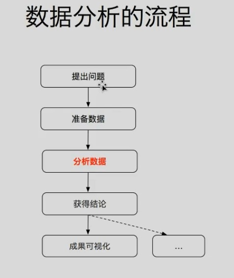

# 1. 基础概念和环境

- 数据分析流程
  > 

# 2. matplotlib

- matplotlib 是仿照 MATLAB 构建的数据可视化的 python 库
- 示例：

  ```python
  from matplotlib import pyplot as plt

  x = range(0,24,2)
  y = [15,12,12,12,12,12,12,12,16,11,11,11]

  plt.plot(x,y)
  plt.show()
  ```

## 2.1. 绘制折线图

- 图片调整：plt.figure(figsize=(20,8),dpi=80)
  - 图片大小：宽 20，高 8
  - dpi 表示每英寸点的个数，越高图片越清洗
- 保存图片：plt.savefig("./plt1.png")
  - 可以保存为 svg 矢量图格式，放大不会有锯齿
- 设置 x 轴刻度：plt.xticks(range(0,24))
- 设置 y 轴刻度：plt.yticks(range(0,24))
- 设置 x 轴刻度为字符串
  ```py
  # x为int列表，_x为字符串，两者长度相同，一一对应
  plt.xticks(x,_x)
  ```
- 设置中文字体
  - linux/mac 下查看支持中文的字体：`fc-list :lang=zh`
  - 修改：
    - 导入 matplotlib 后
    - py 文件中通过调用 matplotlib.rc({})可以修改(window/linux)或
      ```python
      import matplotlib
      matplotlib.rc({
        'family':'Microsoft Yahei',
        'Weight':'blod',
        'size':'large`
      })
      ```
    - py 文件中通过调用 matplotlib.font-manager(fname = "path")可以解决（window/linux/mac）
      ```py
      from matlotlib import font_manager
      my_font =font_manager.FontProperties(fname = "path .ttc")
      plt.xticks(fontproperties = my_font)
      ```
- 添加描述信息
  - 添加 x,y 轴描述信息
    ```py
    plt.xlable("时间",fontpropeties=my_font)
    plt.ylable("温度",fontpropeties=my_font)
    ```
  - 添加题目:`plt.title("题目",fontpropeties=my_font)`
- 设置网格：
  - plt.grid()
    > alpha=0.1 设置透明度
- 添加图例：
  ```py
  plt.plot(x,y1,lable="name1")
  plt.plot(x,y2,lable="name2")
  plt.legend(prop = my_font)
  # 加入prop来显示中文，其他地方都写fontproperties
  ```
- 设置线样式
  ```py
  # 查源码去！！
  plt.plot(x,y,color = "",linestyle="",linewidth="",alpha="")
  ```

## 绘制散点图

- 示例：
  ```py
  plt.scatter(x,y)
  ```

## 绘制条形图

```py
plt.bar(x,y)

# 设置粗细
plt.bar(x,y,width=0.3)

# 绘制横着的条形图，注意，竖着得依旧为y。第一个传给横着得轴，第二个传给竖着的轴
plt.barh(y,x)

# 设置粗细，因为横了，所以成了height
plt.barh(x,y,height=0.3)

```

## 绘制直方图

# 3. numpy

# 4. pandas
